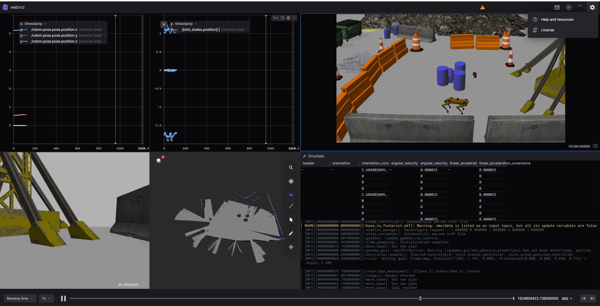

# ROS packsages for spot gazebo

## Install

1. Install ros melodic on the computer. [link](http://wiki.ros.org/melodic/Installation/Ubuntu)
    ```
    apt install -y ros-melodic-joint-state-publisher-gui ros-melodic-interactive-marker-twist-server ros-melodic-robot-state-publisher
    apt-get install -y ros-melodic-rosbridge-suite
    ```

2. Build packages
    ```
    cd ~
    mkdir spot_ws
    mkdir spot_ws/src
    cd spot_ws/src
    git clone https://github.com/QinjieLin-NU/web-spot.git
    cd ~/spot_ws
    apt-get install -y python-pip
    pip install  rosdep
    rosdep init
    rosdep update
    rosdep install --from-paths src --ignore-src -r -y
    catkin_make
    ```


## Run

1. Launch gazebo spo, navigation package and web socket for web.
    ```
    export GAZEBO_HOSTNAME=localhost
    roslaunch spot_config gazebo.launch 
    roslaunch spot_config slam.launch rviz:=true
    roslaunch rosbridge_server rosbridge_websocket.launch
    ```

2. launch webviz and then open link [http://localhost:8080/?rosbridge-websocket-url=ws://localhost:9090](http://localhost:8080/?rosbridge-websocket-url=ws://localhost:9090). 
    ```
	docker run -p 8080:8080 cruise/webviz
    ```
    <!--   -->
    