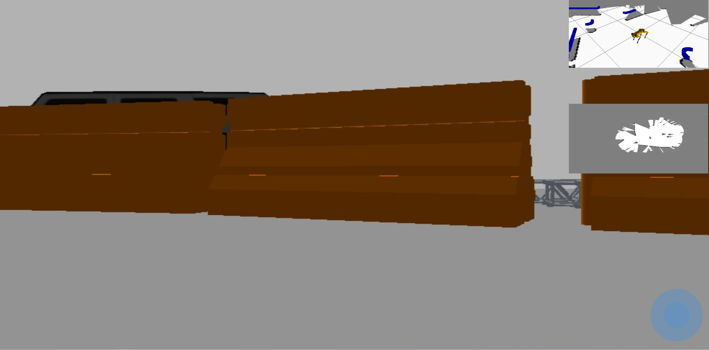

# demo_web
web front-end for robot demos:  


## Run

### move related files

```
apt-get update -y && \
apt-get install -y ros-melodic-web-video-server && \
apt-get install -y ros-melodic-tf2-web-republisher
cp gui/src/cors_server.py /opt/ros/melodic/share/.
git clone https://github.com/QinjieLin-NU/web-spot.git
cp -r web-spot/spot_ros/pot_description /opt/ros/melodic/share/.
```

### launch spot simulation

```
roslaunch spot_config gazebo.launch
roslaunch spot_config  slam.launch rviz:=true
```

### launch web related tools

deine your websocker port, cors-server port and web-vedio-server port  
```
rosrun rosapi rosapi_node
rosrun rosbridge_server rosbridge_websocket _port:=9090
rosrun tf2_web_republisher tf2_web_republisher
rosrun web_video_server web_video_server _port:=9092
python cors_server.py  9094
python pose_publisher.py 
python -m SimpleHTTPServer 8000
```

